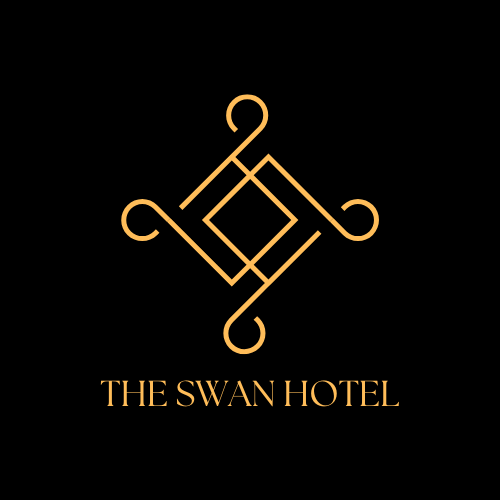

# The Swan Hotel Management System (v2.0)



The Swan is a robust Python-based desktop application designed for comprehensive hospitality management. It features a tiered authentication system that provides specialized tools for Admins, Supervisors, and Staff to streamline guest registration, departmental billing, inventory tracking, and system-wide security auditing via a PostgreSQL backend.

---

## 📌 Project Overview
The **Swan Hotel Management System** is a sophisticated, all-in-one desktop application designed to centralize and automate the day-to-day operations of **The Swan Hotel**. Built with Python and PostgreSQL, the system provides a seamless experience for administrators, department heads, and staff to manage everything from guest check-ins to departmental inventories and system security.

The application features a modern, themed GUI with role-based access control, ensuring that every user has the tools they need to perform their duties efficiently.

---

## 🛠 Features

### 🔐 Multi-Tier Authentication
- **Admin Access:** Full system control, including staff deployment and department management.
- **Departmental Access:** Management tools for department heads to oversee their specific teams.
- **Staff Access:** Operational tools tailored to specific hotel departments (Housekeeping, F&B, Front Office, etc.).

### 🏨 Hotel Operations
- **Front Office:** Guest registration (Check-in), room allocation, and automated billing/Check-out.
- **Housekeeping:** Room status tracking, task sheets, and linen management.
- **Food & Beverage (F&B):** Menu management, restaurant billing, and stock control.
- **Finance:** Integrated billing processing, payroll assistance, and financial reporting.
- **ICT & Maintenance:** Support ticketing system, network monitoring, and system health checks.

### ⚙️ Administrative Tools
- **Staff Lifecycle:** Create, update, and manage staff records with unique IDs.
- **Role Management:** Define and assign custom roles (e.g., Manager, Supervisor, Staff) with specific permissions.
- **Security Audits:** Account locking/unlocking, password reset Management, and action logging.
- **Database Maintenance:** Integrated backup and restore functionality.

---

## 🚀 Technology Stack
- **Core:** Python 3.x
- **GUI:** Tkinter & Pillow (PIL)
- **Database:** PostgreSQL (via `psycopg2`)
- **Security:** Password hashing and secure key management.
- **Compatibility:** Windows (optimized for desktop deployment).

---

## 📂 Project Structure
- `main.py`: The entry point and navigation controller.
- `login.py`: Secure login interface and role routing.
- `admin.py` & `dashboard.py`: Administrative control panels.
- `departments.py`: Departmental management hub.
- `users.py`: Operational interface for general staff.
- `heads.py`: Supervisor/Manager tactical dashboard.
- `database.py`: PostgreSQL connection management.
- `backups.py`: Database backup and recovery logic.
- `/images`: High-quality UI assets and backgrounds.
- `/files`: System exports and logs.

---

## 🔧 Installation & Setup

### Prerequisites
1. **Python 3.x** installed.
2. **PostgreSQL** server running locally.
3. Install required dependencies:
   ```bash
   pip install pillow psycopg2-binary tkcalendar bcrypt
   ```

### Database Configuration
1. Create a database named `Swan`.
2. Import the latest schema from `Swanv2.1.sql`:
   ```bash
   psql -U postgres -d Swan -f Swanv2.1.sql
   ```
3. Update `database.py` with your PostgreSQL credentials if different from the default.

### Running the App
Execute the main script:
```bash
python main.py
```

---

## 📜 License
This project is proprietary software. **All Rights Reserved.**
Please refer to the [LICENSE](LICENSE) file for detailed terms of use.

---

## 👨‍💻 Developed for The Swan Hotel
*Optimizing Hospitality through Innovation.*
